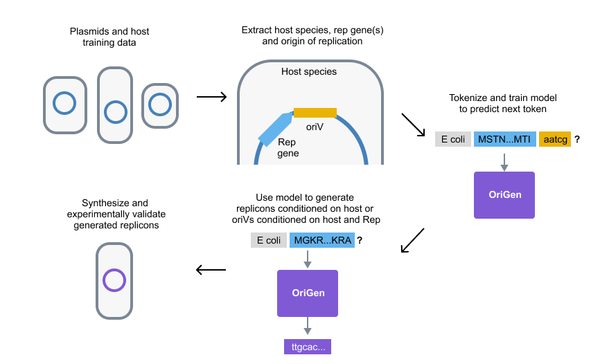

# OriGen


OriGen is a language model capable of generating host-dependent plasmid replicons—the minimal genetic units required for replication. This repository contains the code implementation described in our preprint ["Generating functional plasmid origins with OriGen"](https://www.biorxiv.org/content/10.1101/2025.02.03.636306v1), which demonstrates the first experimentally validated AI-generated sequences capable of biological replication.

This repository includes:
* Model training and inference scripts
* Evaluation pipelines
* Example notebook demonstrating usage
* Example notebook demonstrating pipeline used to generate sequences at varying similarity levels along with matched random sequences, as experimentally validated in paper

## Installation

### Basic installation
For using the OriGen model to generate sequences:
```bash
git clone https://github.com/j-irvine/origen.git
cd origen
pip install -e .
```
### Optional dependencies
For reproducing sequence similarity analyses from the paper, EMBOSS needs to be installed:
```
# macOS
brew tap brewsci/science
brew install brewsci/science/emboss

# Ubuntu/Debian or Google Colab
apt-get install emboss

# Other systems
# Download from EMBOSS website: http://emboss.sourceforge.net/download/
```

## Basic Usage

```python
from origen import inference
from transformers import AutoModelForCausalLM, AutoTokenizer

# Load model from HuggingFace
model_name = "jirvine/origen-model"
tokenizer = AutoTokenizer.from_pretrained(model_name)
model = AutoModelForCausalLM.from_pretrained(model_name)

# Generate sequences for E. coli
sequences = inference.generate_sequences(
    model=model,
    tokenizer=tokenizer,
    num_sequences=5,
    prompt="[Escherichia coli]",
    max_length=1000,
    temperature=1.0,
    top_k=4
)
```

For more detailed usage, see `examples/basic_usage.ipynb`.

## Repository Structure

```
origen/
├── origen/          # Core package
├── scripts/         # Training and evaluation scripts
├── examples/        # Usage examples and notebooks
└── requirements.txt # Dependencies
```

## Datasets

The replicon datasets used for OriGen are available on HuggingFace:
* [DoriC + PLSDB dataset](https://huggingface.co/datasets/jirvine/origen-replicons-doric-and-plsdb) containing replicon sequences used for training and validation
* [IMG/PR dataset](https://huggingface.co/datasets/jirvine/origen-replicons-imgpr) containing sequences used for held-out evaluation

## Citation

If you use this code in your research, please cite:

```
@article{irvine2024generating,
  title={Generating functional plasmid origins with {OriGen}},
  author={Irvine, Jamie and Arora, Jigyasa and Martinson, Jonathan N.V. and Patel, Jaymin R. and Hasham, Sarah I. and Cress, Brady F. and Rubin, Benjamin E.},
  journal={bioRxiv},
  year={2024},
  doi={https://doi.org/10.1101/2025.02.03.636306}
}
```